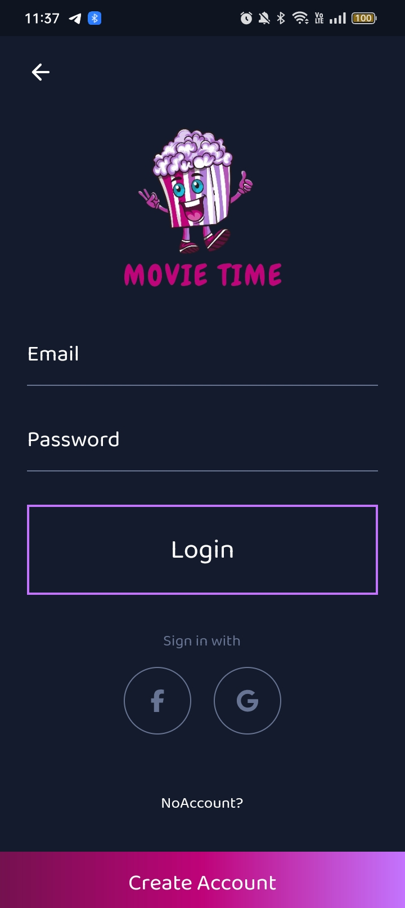
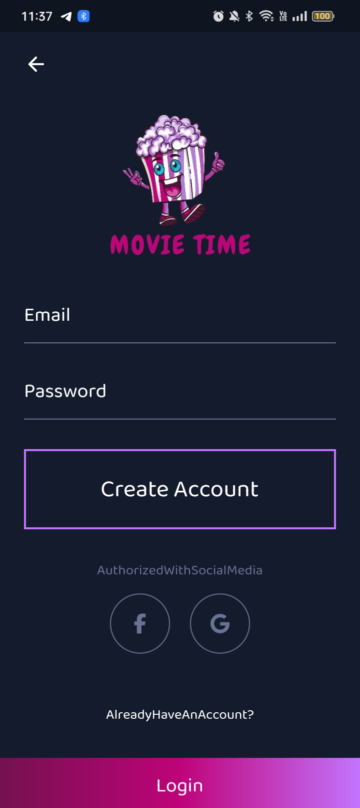
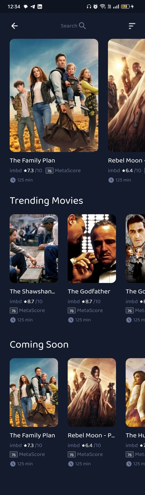
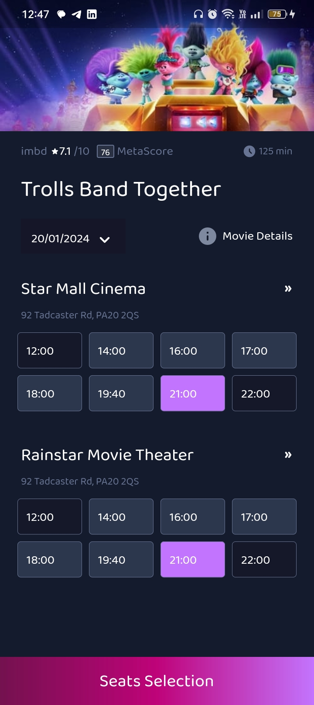
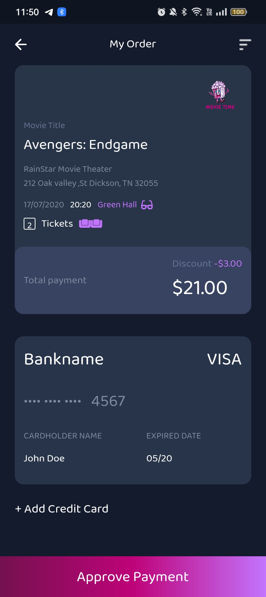
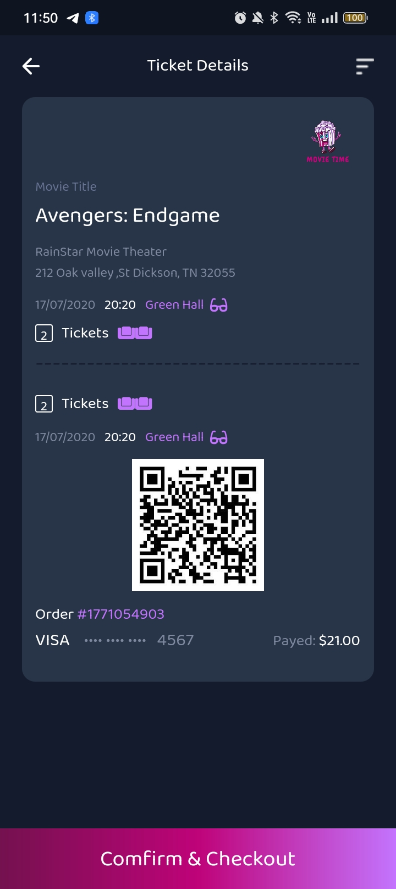
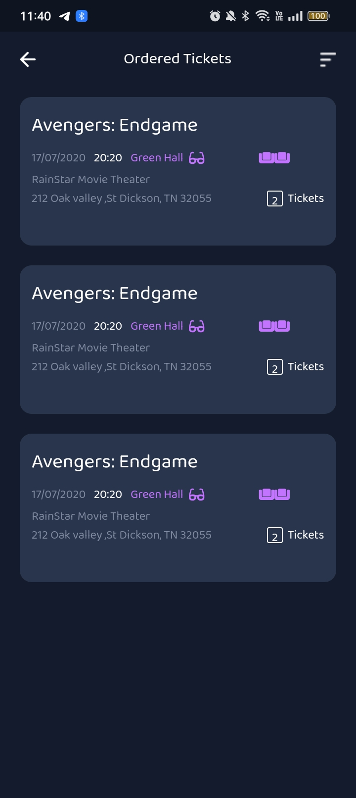

# Movie Time Application 🎞🎞
- Flutter Movies mobile app using API with many functionalities. 
- BloC state management used to manage app's business logic.

## ✨ Features
- Easy to use
- login and sign up user
- Display trending movies.
- Display now playing movies.
- Display coming soon movies.
- Display details of movie.
- Smart design

  ## 🔌 Packages
- flutter_bloc
- dio
- flutter_svg
- shared_preferences

  ## 📸 ScreenShots
| Movie Time                                     | Application                                 |
| -----------------------------------------      | --------------------------------------------|
|      |   |
|      |   |
|      |   |
|      |   |
|      |  |
